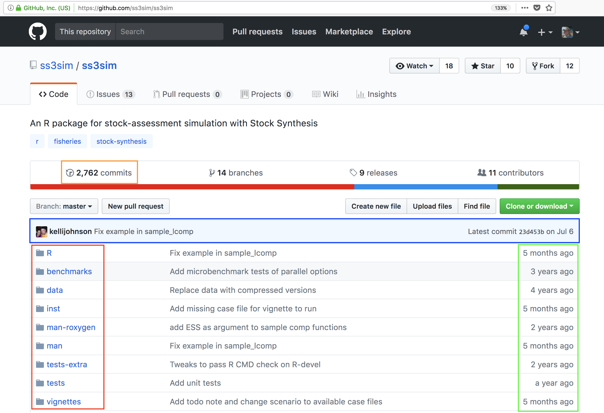
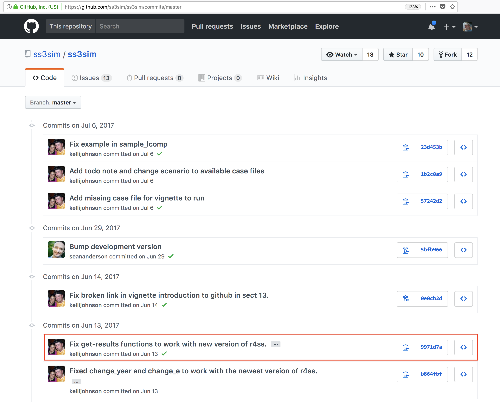
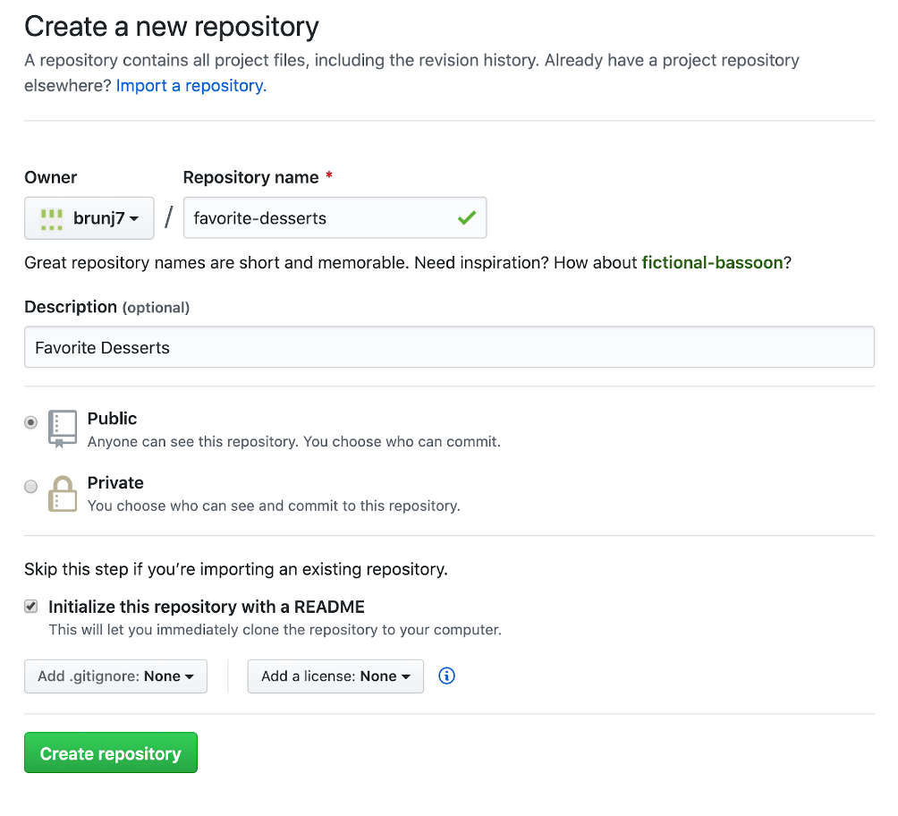

```{r setup, include=FALSE}
knitr::opts_chunk$set(echo = TRUE)
```

# Version Control with git and GitHub

## Learning Objectives

In this lesson, you will learn:

- Why __git__ is useful for reproducible analysis
- How to use __git__ to track changes to your work over time
- How to use __GitHub__ to collaborate with others
- How to structure your commits so your changes are clear to others
- How to write effective commit messages

## The problem with `save_as`

```{r phd_comics_final, out.width='80%', fig.align="center",echo=FALSE}
knitr::include_graphics("img/phd_comics_final.png")
```

Every file in the scientific process changes.  Manuscripts are edited. Figures get revised.  Code gets fixed when problems are discovered.  Data files
get combined together, then errors are fixed, and then they are split and combined again. In the course of a single analysis, one can expect thousands of
changes to files.  And yet, all we use to track this are simplistic *filenames*.  You might think there is a better way, and you'd be right: __version control__.

Version control systems help you track all of the changes to your files, without
the spaghetti mess that ensues from simple file renaming.  In other words, version control is a system that helps you to manage the different versions of your files in an organized manner. It will help you to never have to duplicate files using `save as` as a way to keep different versions of a file (see below). Version control help you to create a timeline of snapshots containing the different versions of a file. At any point in time, you will be able to roll back to a specific version. Bonus: you can add a short description (commit message) to remember what each specific version is about.

**What is the difference between `git` and `GitHub`?**

- __git__: is a version control software used to track files in a folder (a repository)
    - git creates a timeline or history of your files
- __GitHub__: is a code repository in the cloud that enables users to store their git repositories and share them with others. Github also add many features to manage projects and document your work.


## git

 

This training material focuses on the code versioning system called `Git`. Note that there are others, such as `Mercurial` or `svn` for example.

Git is a *free* and *open source* distributed *version control system*. It has many functionalities and was originally geared towards software development and production environment. In fact, Git was initially designed and developed in 2005 by Linux kernel developers (including Linus Torvalds) to track the development of the Linux kernel. Here is a [fun video](https://www.youtube.com/watch?v=4XpnKHJAok8) of Linus Torvalds touting Git to Google. 

**How does it work?**

Git can be enabled on a specific folder/directory on your file system to version files within that directory (including sub-directories). In git (and other version control systems) terms, this “tracked folder” is called a **repository** (which formally is a specific data structure storing versioning information).

**What git is not:**

- **Git is not a backup per se**
- Git is not good at versioning large files (there are workarounds) => not meant for data


### Repository

Git can be enabled on a specific folder/directory on your file system to version files within that directory (including sub-directories). In git (and other version control systems) terms, this “tracked folder” is called a **repository** (which formally is a specific data structure storing versioning information).

Although there many ways to start a new repository, [GitHub](https://github.com/) (or any other cloud solutions, such as [GitLab](https://about.gitlab.com/)) provide among the most convenient way of starting a repository.


## GitHub  
	
**GitHub is a company that hosts git repositories online** and provides several collaboration features (among which `forking`). GitHub fosters a great user community and has built a nice web interface to git, also adding great visualization/rendering capacities of your data.

- **GitHub.com**: <https://github.com>
- **A user account**: <https://github.com/brunj7>
- **An organization account**: <https://github.com/nceas>
- **NCEAS GitHub instance**: <https://github.nceas.ucsb.edu/> 

### Let's look at a repository on GitHub

This screen shows the copy of a repository stored on GitHub,
with its <span style="color:red">list of files</span>, <span style="color:green">when the files and directories were last modified</span>, 
and <span style="color:blue">some information on who made the most recent changes.</span>  



If we drill into the 
"<span style="color:orange">commits</span>" for the repository, we can see the history of changes made to all of 
the files.  Looks like `kellijohnson` and `seananderson` were fixing things in
June and July:



And finally, if we drill into the changes made on June 13, we can see exactly what
was changed in each file:


Tracking these changes, and seeing how they relate to released versions of software and files
is exactly what Git and GitHub are good for. We will show how they can really 
be effective for tracking versions of scientific code, figures, and manuscripts
to accomplish a reproducible workflow.


## Hands-on 


In this section we will be using the GitHub.com website and show you do not need to be a programmer to use version control and edit files on GitHub!

### Our asks

As a Team of two:
- Help each other, everyone is bringing different skills! Talk it out!
- Listen to each other; avoid judgment and solutioneering.
- Have fun!

### Prompt 

#### Person 1 (owner):

- Create a (first) repository following [these instructions](https://docs.github.com/en/github/getting-started-with-github/create-a-repo) steps 1-6



#### Person 2: Modify a file

- Refresh the webpage
- Click on pen at the top of the README.md file


- Replace the title with something better! (don’t rename it)
- Add your name and your favorite dessert below the title: e.g. `-  Julien: crepes`
- Add a descriptive message


- Commit your changes

```{r commit-button, out.width='30%', ,echo=FALSE}

knitr::include_graphics("img/github-commit-button.png")
```


#### Person 1: add a file

Download this [csv file](https://aurora.nceas.ucsb.edu/~brun/favorite_desserts.csv) about your favorite desserts to your computer

- Just drag and dropit on the Github webapge of your repository to upload it
- Add a short message about the file e.g. `Adding dessert csv`
- Click on the filename to see it!

Bonus Person 2:
Try to edit the csv file directly on GitHub!
